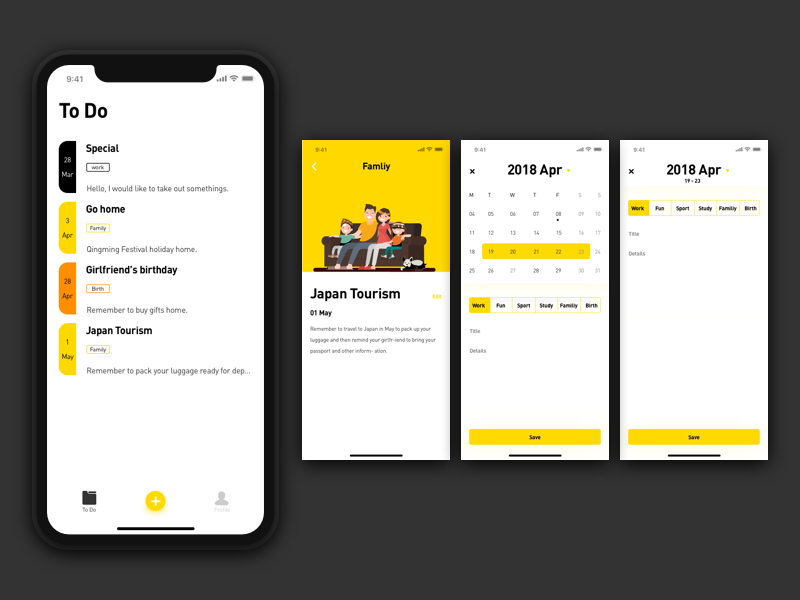

# Hackathon 20/04/2020
## Todo List Application 
1. Main function
- Add a note with title, content, and tag.
- View list all note created.

2. Optional 
- Edit note created.
- Delete note created.

3. UI Sample 


4. Database Model Description:
A table with 5 columns <br>

`id : INTEGER` - contain the unique id of each note 

`title : TEXT` - contain the title of note

`content : TEXT` - contain the content of the note

`tag : TEXT` - tag of the note, all available tags are HOME, FAMILY, WORK, DEFAULT. Each note has a tag which define background color for the note. Do not use any tag else.

`showtime : DATETIME` - reminder the user at this time. 

Create database by execute this SQL statement

```sql
DROP TABLE IF EXISTS "todo";
CREATE TABLE "main"."todo" (
  "id" INTEGER NOT NULL,
  "title" TEXT NOT NULL,
  "content" TEXT,
  "tag" TEXT NOT NULL,
  "showtime" DATETIME NOT NULL,
  PRIMARY KEY ("id")
);
```
<br>
In case you are not familiar with SQLite, you can use this file with executed table 
<br>
 
<br>
5. Color <br>
Each tag come with a tag color

- Title text color: 
 `#242424`

- Content text color:
 `#545454`

- HOME tag color:
 `#a5e830`

- FAMILY tag color:
 `#30c9e8`

- WORK tag color:
 `#8930e8`

- DEFAULT tag color:
 `#e88c30`

- Background color: 
 `#F7F7F7`

- Primary  color:
 `#e88c30`

- Primary dark color:
 `#915110`

- Accent color: 
 `#16a9c7`

